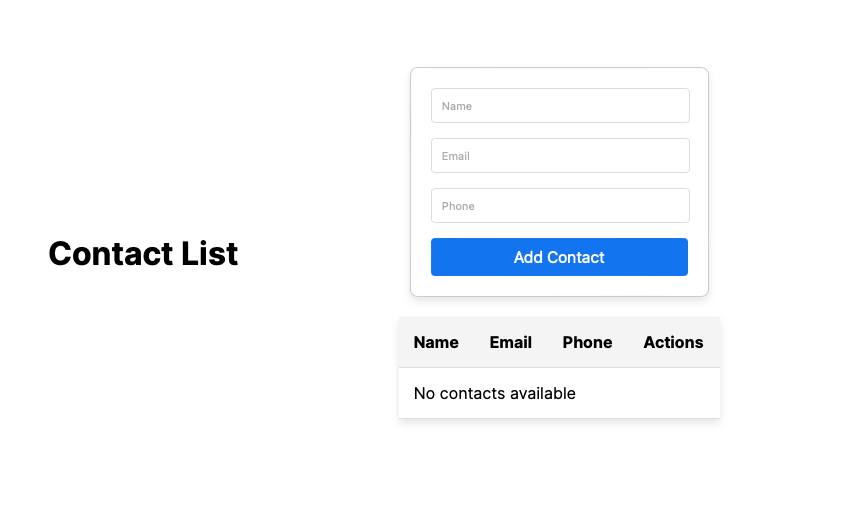
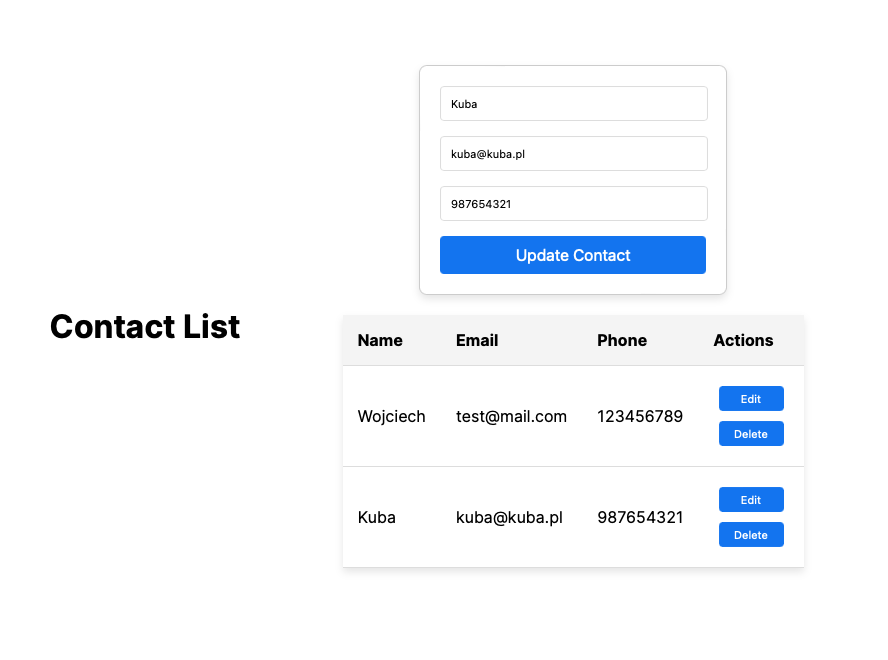

# FullStackExample

## Opis

Aplikacja jest prostym przykładem realizującym założenie listy kontaktów umożliwiającą
dodawanie,  usuwanie oraz edycję użytkowników.

## Instrukcja uruchomienia

### Backend

cd contacts-backend  
npm run start

### Frontend

cd contacts-frontend  
npm run dev

## Uwaga

z racji na rozmiar w repozytorium nie zostały dołączone moduły node.
Należy je doinstalować samodzielnie

## Zrzuty ekranu

### Interfejs użytkownika

### Lista kontaktów z wprowadzonymi rekordami

### Aktualizacja danych użytkownika

